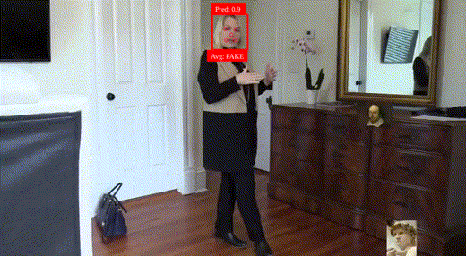
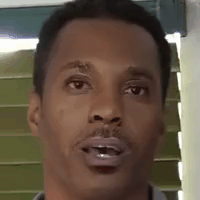
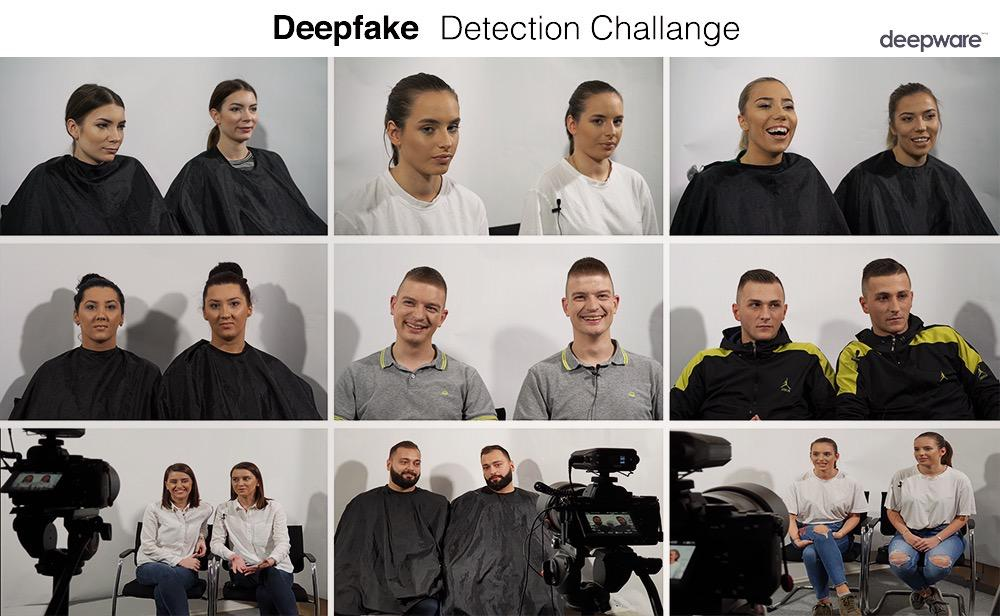

## Deepware Scanner

### Introduction

As deepfake technology improves every day, deepfake detection falls behind and continues to be a major challenge. The vast majority of current solutions, including ours, are approaching deepfake detection as a generic classification task. Hence, they use ImageNet's pre-trained ConvNets and finetune them with generic augmentations. We recognize the difficulty of the problem and see the necessity of new approaches.

Here, we share our deepware scanner with the community, and we show its detection results on various deepfake datasets, including organic deepfake and real videos. A more advanced model that covers more deepfake algorithms, such as [avatarify](https://github.com/alievk/avatarify) runs on [deepware.ai](https://deepware.ai).

### Our Classifier

We use an `EfficientNet B7` model that was pre-trained on the ImageNet dataset. We trained our classifier with only Facebook's [DFDC](https://arxiv.org/abs/2006.07397) dataset, which consists of 120k videos. We trained our model to work in production, and it was trained with an emphasis on fewer false positives.

The model is a frame-based classifier meaning that it doesn't account for temporal coherence. Since video is a temporal medium, we consider this to be a major shortcoming that needs to be addressed. We will discuss temporal detection in the research section.

#### Training Details

Facebook's DFDC dataset contains ~20k real videos and ~100k deepfakes generated from them using different methods. There are approximately 400 different people in this dataset. Videos are 10 seconds long, and most of them feature a single person. Fake versions of a real video are given in the metadata.

We first clustered the unique people in the dataset. To prevent overfitting to identities, 90% of the people are used for the training set, and 10% are used for the validation set. For the test set, other academic and organic datasets were used.

We eliminated videos that featured multiple people for simplicity. We then extracted faces with a `1.65` margin. Commonly used augmentations were applied during training, such as `Flip`, `GaussianNoise`, `Blur`, `BrightnessContrast`, and so on.

Since the dataset is unbalanced (100k fake & 20k real), we had to balance it ourselves. A simpler approach is to pick 20k fakes and use a total of 40k videos. That approach works well if you pick the 20k fakes carefully. A better approach is using the whole dataset and sampling randomly from reals and fakes with the same frequency during training.

Here's the dataloader logic we used for training:
- Pick a random ID from the training ID set.
- Pick a random real video of that ID.
- Decide whether we should return a real or fake sample (fifty-fifty).
- In case of a fake, pick a random fake version of that video.
- Return a random face from the selected video.

This approach lets us use the whole dataset while keeping it balanced. It has proved to be better than the simpler approach.

#### Scanning Pipeline

Our scanning steps from video input to prediction score is described below:

1) Decode video and read frames at 1 FPS. 
2) Detect every face from these frames and extract them with a margin of `1.65`.
3) Send detected faces to our classifier, and get the individual predictions.
4) Cluster faces with a minimum cluster size to ignore outliers and get the distinct persons (IDs) from the video.
5) For each person, calculate a single score based on face predictions using the `id_strategy` function.
6) Calculate the final video score based on per-person scores using the `strategy` function.

Empirical analysis has shown that 1 FPS is a good compromise between scanning speed and detection accuracy. Clustering faces allows us to remove noise such as falsely detected faces. Only the consistently detected faces will be clustered, and the detection score will be calculated only for them. In the deepfake video below, faces pop up randomly, but they are considered noise thanks to clustering.

_Image 1: A deepfake video from DFDC test set_

#### Strategy Functions

Even though the model weights are identical, different strategy functions can produce different detection scores.

The `id_strategy` function takes a bunch of face predictions and produces the final score for the person. Its job is to make sure that face predictions are confident and consistent across all the faces. Inconsistent predictions are penalized.

The `strategy` function takes per-person scores from the `id_strategy` and produces the final score of the video.
- If there's a high confident fake person, it will return its detection score.
- If every person is real and predictions are consistently low, it will return the minimum detection score.
- If there's no fake person but we're not very confident that every person is real, we return the average of all predictions.

These strategy functions might not be the best for competitions, but in the real world, most of the videos are real, and false positives are not well received.

### Detection Results

Here, we share the detection results of our model on various academic and organic datasets. In addition to our model, we show the results of another model that was selected from DFDC ([Facebook's Deepfake Detection Challenge](https://www.kaggle.com/c/deepfake-detection-challenge)) winning solution. Both models have the same architecture and were trained on the same dataset. We used the best performing single model from [Seferbekov's](https://github.com/selimsef/dfdc_deepfake_challenge) ensemble.

|Dataset                        |Deepware Loss|Deepware Accuracy|Seferbekov Loss|Seferbekov Accuracy|
|-------------------------------|-------------|-----------------|---------------|-------------------|
|DFDC 4000                      |0.27822      |87.1             |0.28365        |88.5               |
|DFDC 5000                      |0.21314      |91.3             |0.22365        |91.3               |
|Celeb-DF Real                  |0.19967      |93.1             |0.22302        |90.8               |
|Celeb-DF Fake                  |0.31306      |85.6             |0.17771        |92.9               |
|Celeb-DF Youtube               |0.23837      |89.0             |0.34528        |85.3               |
|FaceForensics DeepFakeDetection|0.33143      |84.2             |0.45622        |80.9               |
|FaceForensics Actors           |0.07319      |99.7             |0.08872        |98.6               |
|FaceForensics DeepFakes        |0.17404      |92.7             |0.21269        |91.9               |
|FaceForensics Youtube          |0.24260      |90.9             |0.28419        |89.7               |
|MrDeepFakes                    |0.55549      |75.4             |0.56490        |76.4               |
|4chan Real                     |0.26039      |92.6             |0.34112        |88.8               |

_`DFDC 4000` dataset is the public test, and `DFDC 5000` is a subset of the private test set from the Facebook's Kaggle competition._

The loss values are [binary cross entropy](https://en.wikipedia.org/wiki/Cross_entropy) _(lower is better)_. Accuracies are close on the deepfake videos, while the deepware model performs consistently better on real videos.

There are two organic datasets in the table: `MrDeepFakes` and `4chan Real` datasets. `4chan Real` consists of 1506 short clips taken from 4chan's [/wsg/](https://boards.4channel.org/wsg/catalog) board.
`MrDeepFakes` consist of 631 adult deepfake videos. They are mostly high quality fakes and both classifiers perform poorly on them. In general, organic videos are harder due to a much higher variety.

### Research Areas

As mentioned earlier and also [remarked](https://ai.facebook.com/blog/deepfake-detection-challenge-results-an-open-initiative-to-advance-ai/) by facebook, current solutions approach deepfake detection as a generic classification task. We believe that should be changed. The potential danger of deepfakes are too great and we should find a reliable solution while we still have time. Here we share some of the research areas for a better deepfake detection. Currently, we are experimenting on them and we pledge ourselves to share any advancement with the community.

#### Temporal Detection

Video is a temporal medium, and the natural way to classify a video should be with a temporal model. However, image classification is an easier task, and there is more research in that area. Furthermore, image classifiers do a reasonably good job at detecting deepfakes by scanning frame by frame. As a result, temporal detection is not a very popular solution.

We humans are not very good at detecting fakes with a single frame. On the other hand, we detect temporal inconsistencies much more easily. Since the current deepfake models generate fake videos one frame at a time, temporal coherence is their weak spot.

The following is a short deepfake clip that shows temporal inconsistency. Although the individual frames look real, the video is an obvious fake.

There are different approaches to temporal models like 3D convolutions and 2D convolutions with an LSTM. We will not dive into details on them but we believe that temporal models are the future of deepfake detection.

#### Visual Artifacts

Deepfake generation is a long pipeline, and visual artifacts are introduced in every step. Those artifacts are usually not visible to our eye, but a ConvNet can learn to detect them easily.

The deepfake pipeline is roughly the following:

- Extract frames and faces from the video.
- Scale and rotate faces to standardize.
- Feed the faces into a deepfake model to generate fake faces.
- Reverse the scaling and rotation.
- Blend fake faces onto original video frames.
- Create the final deepfake video from modified frames.

The fake faces generated by deepfake models have certain characteristics. They are generated by a neural network rather than a camera. Although, in theory, a neural network can generate an image indistinguishable from a real one. In practice, we see distinct features in network-generated images such as blurring, lack of fine details, eye and teeth problems and so on.

Warping artifacts are another class of artifacts. Deepfake models accept the faces in a standard size, but in the source video, face size is almost certainly different, and it changes throughout the video. Thus, the deepfake software first has to resize the face to feed into the model and resize the generated fake face back to the original dimensions. This resizing and rotating produce distinct artifacts.

Finally, the generated face must be blended onto the original head. This is done with a blending algorithm that works on the gradient domain. The algorithm is called [poisson blending](https://www.cs.jhu.edu/~misha/Fall07/Papers/Perez03.pdf). This step also introduces distinct blending artifacts.

#### Compression Artifacts

Video compression and lossy image compression is achieved by a certain transform called [Discrete cosine transform](https://en.wikipedia.org/wiki/Discrete_cosine_transform). The compression algorithm divides the image into square blocks such as 4x4 or 8x8 pixel blocks. Each block is compressed independently, and this causes color inconsistencies between neighboring blocks due to quantization. These blocking artifacts are well known for jpeg images and h264 videos.

While the real frames have these subtle compression artifacts, a neural network-generated face doesn't. When the real frame and fake face are blended together, a convolutional network can identify the artifact differences between the face area and the rest of the frame.

Notice that in the final video, the face area is compressed only once, while the rest of the frame is compressed at least twice. There are methods to detect double compression that can be used to identify single compression areas in a double compressed frame.

If the final video compression ratio is too high, the compression artifacts can mask anything we mentioned above. Highly compressed deepfake videos are the greatest challenge for the deepfake detection so far.

#### Adversarial Attacks

Adversarial examples are input images tailored specifically to deceive a classifier. A deepfake image with a special noise can cause a deepfake model to malfunction and classify the fake as real with high confidence.

Ian Goodfellow —one of the pioneers of this field— states; "We do not yet know whether defending against adversarial examples is a theoretically hopeless endeavor."

The following image is an example of adversarial attacks. A small noise is added to the panda image on the left, and the result is an adversarial example on the right. Although the human eye doesn't see any difference between the original and modified images, the classifier network is deceived and identifies the panda image as a gibbon with high confidence.

### Conclusion

We believe that the deepfake problem should be solved with the community by working together. Hence, we open-sourced our current deepware scanner, and we promise to share further advancement with the community.

At deepware, we build in-house datasets as required for our experiments, and we will also share them with the community, so stay tuned! The following is an image that shows our in-house identical-twin dataset that we used for certain experiments.

The result of the current state of the art models was shared above, and it's obvious that the deepfake problem is far from being solved. We listed some of the promising research areas. It's not a complete list, but it's a start.
